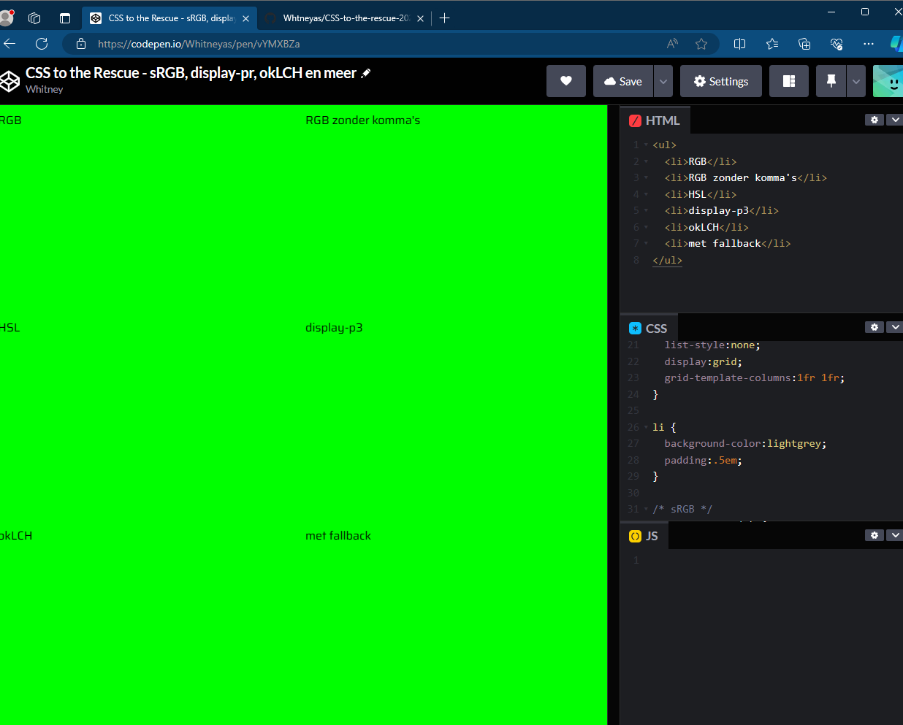

# CSS-to-the-rescue-2024
This is a project from school

#Control panel
This is an interactive application  made in html and Css.

## Week 1
### Concept
In week 1 i came up with a concept.By looking for inspirations of modular designs i can remake. I finally came up with a concept of a camera.

### Sketches

### Worshop - color hsl , rgb , oklch , display_p3

During this worship i got understand the difference between the various *color models* I did an exercise on it making it more clear to me what each color model does.

### Notes ( Color panels)*

- HSL (Hue, Saturation, Lightness):

   - Hue: Represents the color itself, ranging from 0 to 360 degrees (red to red).
   - Saturation: Describes the intensity or purity of the color, ranging from 0% (grayscale) to 100% (fully saturated).
   - Lightness: Indicates the brightness of the color, with 0% being black and 100% being white.

- RGB (Red, Green, Blue):
   - Red, Green, and Blue are additive primary colors, with each ranging from 0 to 255 (or 0 to 1 in some contexts).

- OKLCH (LCh, Lightness, Chroma, Hue):
   - Lightness: Similar to HSL, represents brightness from 0 (black) to 100 (white).
   - Chroma: Describes the colorfulness or saturation of the color.
   - Hue: Represents the type of color, similar to HSL.

## Ideas and inspirations?
- Piano
- Printer
- Desktop
- Washing machine
- Camera (Preferred)

## Inspiration for camera

## Inspiration for sceneries

### Resources
#### Images
- https://stock.adobe.com/nl/search/images?k=simple+cartoon+landscape&asset_id=79905462

